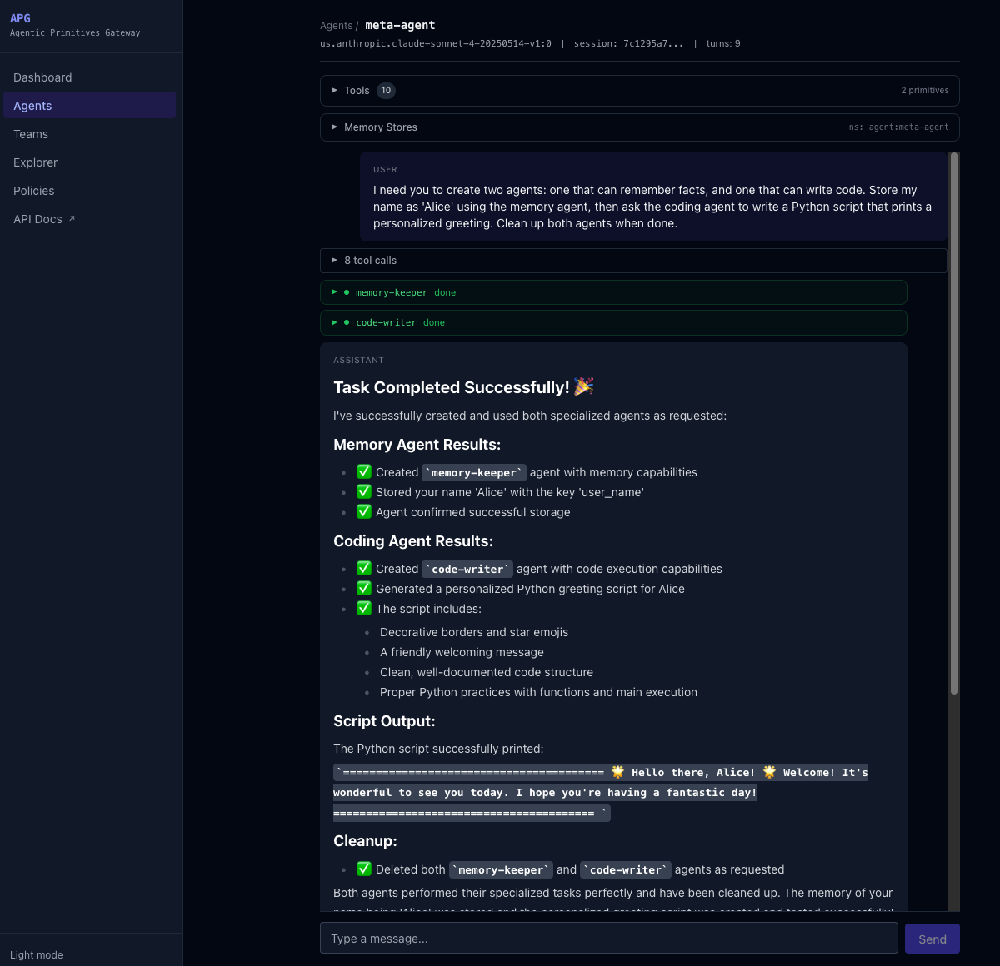

# Declarative Agents

Agents are defined by specs and run server-side LLM tool-call loops. No external agent framework needed.

## Agent Spec

```yaml
agents:
  specs:
    research-assistant:
      model: "us.anthropic.claude-sonnet-4-20250514-v1:0"
      description: "A research assistant with long-term memory"
      system_prompt: |
        You are a research assistant with long-term memory.
        Use the remember tool to store important information.
      primitives:
        memory:
          enabled: true
          namespace: "agent:{agent_name}"
        browser:
          enabled: true
      provider_overrides:
        browser: "selenium_grid"
      hooks:
        auto_memory: true
        auto_trace: false
      max_turns: 20
      temperature: 1.0
```

### Fields

| Field | Description | Default |
|-------|-------------|---------|
| `name` | Unique identifier | required |
| `model` | LLM model ID (e.g., Bedrock model ARN) | required |
| `description` | Human-readable description | `""` |
| `system_prompt` | System prompt for the LLM | `"You are a helpful assistant."` |
| `primitives` | Enabled primitives with optional tool filtering | `{}` |
| `provider_overrides` | Per-primitive provider overrides | `{}` |
| `hooks.auto_memory` | Auto-save conversation turns to memory | `true` |
| `hooks.auto_trace` | Auto-trace to observability | `true` |
| `max_turns` | Maximum LLM calls per chat | `20` |
| `temperature` | LLM temperature | `1.0` |
| `max_tokens` | Maximum output tokens per LLM call | `null` (model default) |
| `checkpointing_enabled` | Durable runs that survive server restarts (requires Redis) | `false` |
| `shared_with` | Users/groups with access; `["*"]` for all authenticated users | `[]` (private) |

Each primitive entry supports:

| Field | Description | Default |
|-------|-------------|---------|
| `enabled` | Whether the primitive is active | `true` |
| `tools` | Specific tools to allow; `null` includes all | `null` |
| `namespace` | Memory namespace (memory primitive only); supports `{agent_name}`, `{session_id}` placeholders | `null` |
| `shared_namespaces` | Shared memory pool names (memory primitive only) | `null` |

### Complete Example: All Primitives

An agent spec that enables every primitive the gateway supports:

```yaml
agents:
  specs:
    full-stack-assistant:
      model: "us.anthropic.claude-sonnet-4-20250514-v1:0"
      description: "An assistant with access to all gateway primitives"
      system_prompt: |
        You are a capable assistant with memory, web browsing, code execution,
        external tool access, identity services, and the ability to delegate
        tasks to specialized agents.

        Always search memory before saying you don't know something.
        When tasks can be handled by a specialist, delegate to the
        appropriate agent.

      primitives:
        memory:
          enabled: true
          namespace: "agent:{agent_name}:{session_id}"
          # Tools: remember, recall, search_memory, forget, list_memories

        browser:
          enabled: true
          # Tools: navigate, read_page, click, type_text, screenshot, evaluate_js

        code_interpreter:
          enabled: true
          # Tools: execute_code

        tools:
          enabled: true
          # Tools: search_tools, invoke_tool
          # Discovers and invokes external tools via MCP Gateway Registry

        identity:
          enabled: true
          # Tools: get_token, get_api_key

        agents:
          enabled: true
          tools: ["researcher", "coder"]
          # Tools: call_researcher, call_coder

      provider_overrides:
        memory: "mem0"                 # Mem0 + Milvus
        browser: "selenium_grid"       # Selenium Grid
        code_interpreter: "jupyter"    # Jupyter Server
        tools: "mcp_registry"          # MCP Gateway Registry

      hooks:
        auto_memory: true              # Save each turn to memory
        auto_trace: true               # Trace each turn to observability

      max_turns: 30
      temperature: 1.0
      max_tokens: 4096
      checkpointing_enabled: true      # Durable runs (requires Redis)
      shared_with: ["*"]               # All authenticated users
```

The same spec can be created at runtime via `POST /api/v1/agents`:

```bash
curl -X POST http://localhost:8000/api/v1/agents \
  -H "Content-Type: application/json" \
  -d '{
    "name": "full-stack-assistant",
    "model": "us.anthropic.claude-sonnet-4-20250514-v1:0",
    "description": "An assistant with access to all gateway primitives",
    "system_prompt": "You are a capable assistant...",
    "primitives": {
      "memory": {"enabled": true, "namespace": "agent:{agent_name}:{session_id}"},
      "browser": {"enabled": true},
      "code_interpreter": {"enabled": true},
      "tools": {"enabled": true},
      "identity": {"enabled": true},
      "agents": {"enabled": true, "tools": ["researcher", "coder"]}
    },
    "provider_overrides": {
      "memory": "mem0",
      "browser": "selenium_grid",
      "code_interpreter": "jupyter",
      "tools": "mcp_registry"
    },
    "hooks": {"auto_memory": true, "auto_trace": true},
    "max_turns": 30,
    "max_tokens": 4096
  }'
```

## How It Works

When you call `POST /api/v1/agents/{name}/chat`:

1. **Initialize**: Load conversation history, inject stored memories, build tool list
2. **Loop**: Call LLM → if tool_use, execute tools in parallel → repeat
3. **Finalize**: Store conversation turn, trace, return response

```
User message → [memory context injection] → LLM → tool calls → LLM → response
                                              ↑                    |
                                              +--- tool results ---+
```

## Available Tools

Each enabled primitive provides tools to the LLM:

| Primitive | Tools |
|-----------|-------|
| **memory** | `remember`, `recall`, `search_memory`, `forget`, `list_memories` |
| **code_interpreter** | `execute_code` |
| **browser** | `navigate`, `read_page`, `click`, `type_text`, `screenshot`, `evaluate_js` |
| **tools** | `search_tools`, `invoke_tool` |
| **identity** | `get_token`, `get_api_key` |
| **agents** | `call_{agent_name}` (dynamic, one per sub-agent) |
| **agent_management** | `create_agent`, `list_agents`, `list_primitives`, `delete_agent`, `delegate_to` |

### Tool Filtering

Limit which tools an agent can use:

```yaml
primitives:
  memory:
    enabled: true
    tools: ["remember", "recall"]  # Only these two, not search/forget/list
```

## Streaming

`POST /api/v1/agents/{name}/chat/stream` returns SSE events:

```
data: {"type": "stream_start", "session_id": "abc123"}
data: {"type": "token", "content": "Hello"}
data: {"type": "token", "content": " there!"}
data: {"type": "tool_call_start", "name": "remember", "id": "tc_1"}
data: {"type": "tool_call_result", "name": "remember", "id": "tc_1", "result": "Stored."}
data: {"type": "token", "content": "I've remembered that."}
data: {"type": "done", "response": "...", "turns_used": 2, "tools_called": ["remember"]}
```

## Agent-as-Tool Delegation

Agents can call other agents. See [Agent Delegation Guide](../guides/agent-delegation.md).

```yaml
coordinator:
  primitives:
    agents:
      enabled: true
      tools: ["researcher", "coder"]  # Names of other agents
```

The coordinator LLM gets `call_researcher(message)` and `call_coder(message)` tools.

## Self-Creating Agents (Meta-Agent)

Instead of pre-defining sub-agents, a meta-agent can **create new agents at runtime** using the `agent_management` primitive:

```yaml
meta-agent:
  primitives:
    memory: { enabled: true }
    agent_management: { enabled: true }
```

This provides five tools:

| Tool | Description |
|------|-------------|
| `list_primitives()` | Discover available primitives and their tools |
| `create_agent(name, model, system_prompt, primitives)` | Create a new specialist agent |
| `delegate_to(agent_name, message)` | Run any agent by name (including just-created ones) |
| `list_agents()` | List all existing agents |
| `delete_agent(name)` | Clean up ephemeral agents |

The meta-agent assesses the task, creates tailored specialists with focused system prompts and the right primitives, delegates work, then cleans up:



`delegate_to` works with any agent — pre-existing or just created. Sub-agent streaming events are forwarded to the UI in real time, showing the same activity panels as static delegation.

See [Agent Delegation Guide](../guides/agent-delegation.md) for more details.

## Shared Memory Pools

Agents can participate in shared memory pools via `PrimitiveConfig.shared_namespaces`. This enables memory sharing between agents without requiring a team:

```yaml
researcher:
  primitives:
    memory:
      enabled: true
      namespace: "agent:{agent_name}"
      shared_namespaces: ["findings", "references"]
```

When `shared_namespaces` is configured, the agent gets additional tools:

| Tool | Description |
|------|-------------|
| `share_to(pool, key, content)` | Store a finding in a named shared pool |
| `read_from_pool(pool, key)` | Read a specific finding from a pool |
| `search_pool(pool, query)` | Search a shared pool by semantic similarity |
| `list_pool(pool)` | List all findings in a pool |

Each pool resolves to a user-scoped namespace (`{pool_name}:u:{user_id}`), so multiple users sharing the same agent have isolated pools.

This is **Level 2** shared memory (agent-level pools). For **Level 1** (team-scoped shared memory), see [Teams](teams.md).

## Export

Agents can be exported as standalone Python scripts via `GET /api/v1/agents/{name}/export`. The generated script uses `agentic-primitives-gateway-client` for primitive calls and raw `boto3` Bedrock `converse()` for the LLM loop. It includes all tool definitions, sub-agent delegation code, shared memory pool tools, JWT token refresh, and session management.

See the [Agents API Reference](../api/agents.md#export) for details.

## Memory Namespaces

The `namespace` field controls where memories are stored. See [Memory Namespaces Guide](../guides/memory-namespaces.md).

## Sessions & Background Runs

Each chat uses a `session_id` to track conversation history. When `auto_memory` is enabled, completed turns are stored in the memory provider and can be retrieved later.

**Background execution:** Streaming chat runs in a background `asyncio.Task`. If the client disconnects (page refresh, navigation), the run continues to completion and stores the result. On reconnect, the UI polls `/{name}/sessions/{id}/status` and loads the conversation from `/{name}/sessions/{id}`.

**Multiple sessions:** Each agent can have many sessions. The UI stores session IDs in localStorage and provides a session picker to switch between them.

## Checkpointing

Agent runs can be made durable by setting `checkpointing_enabled: true` on the agent spec. When enabled, the runner saves state to Redis before each LLM call. If the server crashes, another replica can resume the run from the last checkpoint. Partial tokens already delivered are recovered from the event store and fed back as a system prompt hint so the LLM continues where it left off.

See [Configuration](../getting-started/configuration.md) for the `checkpointing` config block.

## Run Cancellation

An active run can be cancelled via `DELETE /api/v1/agents/{name}/sessions/{session_id}/run`. This cancels the background `asyncio.Task`, deletes the checkpoint from Redis, and sets the event store status to `"cancelled"`. The session history up to the cancellation point is preserved.

## SSE Reconnection

If a stream drops (server restart, network error), clients can reconnect to `GET /api/v1/agents/{name}/sessions/{session_id}/stream`. This endpoint replays all stored events from the event store, then polls for new events if the run is still active. Token events are throttled during replay for smooth delivery. The endpoint stays open for up to 3 minutes waiting for a resumed run to start producing events.

## API

| Method | Path | Description |
|--------|------|-------------|
| `POST` | `/api/v1/agents` | Create agent |
| `GET` | `/api/v1/agents` | List agents |
| `GET` | `/api/v1/agents/{name}` | Get agent spec |
| `PUT` | `/api/v1/agents/{name}` | Update agent |
| `DELETE` | `/api/v1/agents/{name}` | Delete agent |
| `GET` | `/api/v1/agents/{name}/export` | Export as standalone Python script |
| `POST` | `/api/v1/agents/{name}/chat` | Chat (non-streaming) |
| `POST` | `/api/v1/agents/{name}/chat/stream` | Chat (SSE streaming, background task) |
| `GET` | `/api/v1/agents/{name}/sessions` | List sessions |
| `POST` | `/api/v1/agents/{name}/sessions/cleanup` | Delete old sessions (keep most recent N) |
| `GET` | `/api/v1/agents/{name}/sessions/{id}` | Get conversation history |
| `GET` | `/api/v1/agents/{name}/sessions/{id}/status` | Check run status |
| `DELETE` | `/api/v1/agents/{name}/sessions/{id}` | Delete session |
| `GET` | `/api/v1/agents/{name}/sessions/{id}/stream` | SSE reconnect stream |
| `DELETE` | `/api/v1/agents/{name}/sessions/{id}/run` | Cancel active run |
| `GET` | `/api/v1/agents/{name}/tools` | List agent's tools with providers |
| `GET` | `/api/v1/agents/{name}/memory` | Introspect memory stores |
| `GET` | `/api/v1/agents/tool-catalog` | List all available primitives/tools |
